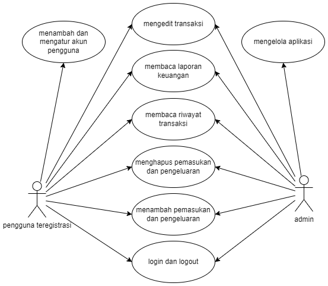
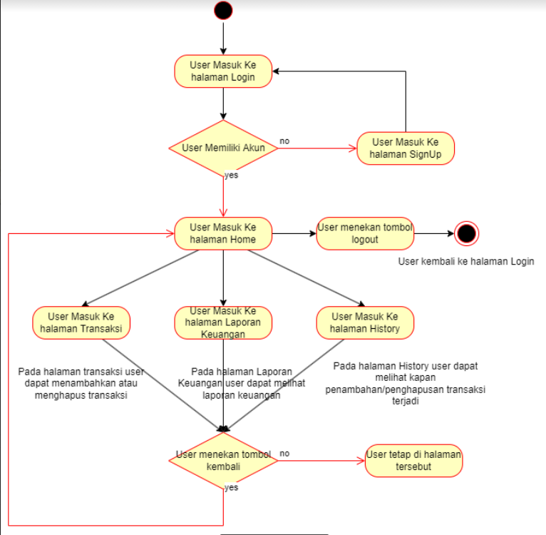
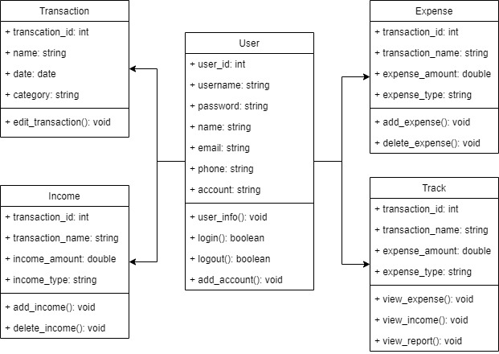

 

 The Team 

 

  
 Nama Kelompok : Moneygement 

 Anggota dan NIM Kelompok 

1. Adrian Syah Abidin - 20/463588/TK/51580 

2. Luthfi Izzuddin Hanif - 20/463605/TK/51597 

3. Kurnia Dwi Utami - 20/456369/TK/50499 

   

---

 

 About Project 

 

“Project Junior Project TI” 

(Departemen Teknologi Elektro dan Teknologi Informasi, Fakultas Teknik, Universitas Gadjah Mada) 

Nama aplikasi : Moneygement 

Kategori      : Gaya Hidup 

Tipe aplikasi : Desktop 

Permasalahan yang dipecahkan 

Saat ini, masih ada begitu banyak orang yang kesulitan mengatur keuangannya. Pencatatan secara manual seringkali mengalami ketidakteraturan ataupun kesalahan saat pencatatan. Dengan demikian, kelompok kami membuat aplikasi ini agar dapat mencatat keuangan secara digital dan mampu mengatasi kekurangan dari pencatatan manual.

Solusi yang diusulkan beserta fitur aplikasi 

Fitur yang kami kembangkan pada aplikasi ini ada 3, yaitu transactions, report, dan track. Fitur-fitur ini membantu pengguna dalam melakukan pencatatan pengeluaran maupun pemasukan melalui fitur transactions, memberikan report berdasarkan transaksi yang diinput pada aplikasi melalui fitur report, serta menunjukkan riwayat transaksi pengeluaran dan pemasukan yang dilakukan pengguna melalui fitur track. Dengan adanya ketiga fitur ini, pengguna diharapkan dapat terbantu dalam mengatur dan mengelola keuangannya.

Aplikasi sejenis yang mirip dengan solusi yang diusulkan: 

YNAB (You Need A Budget)

   

---

 

 UML Document 

 
  

 

 Use Case Diagram 

  

  

 

 User Activity Diagram 

 

  

  

 

 Class Diagram 

  

  

  

