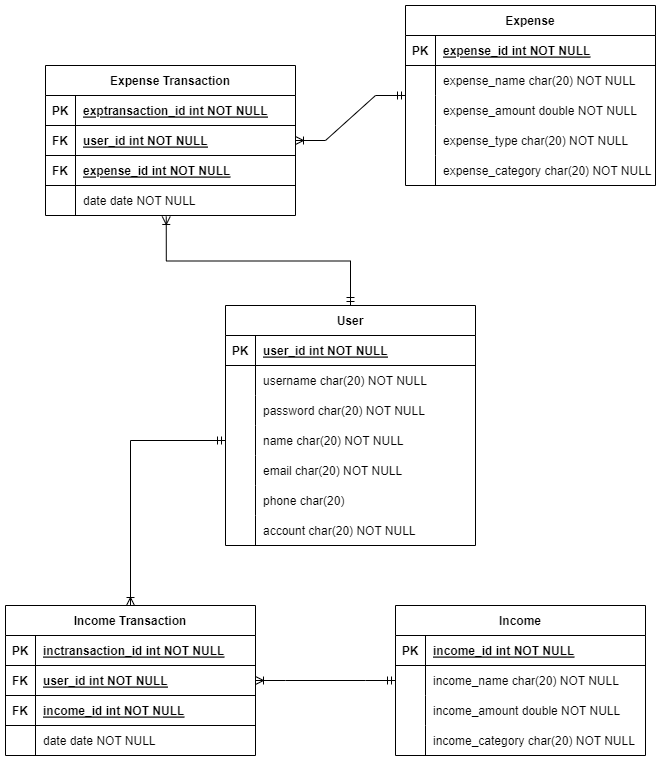

<h1> The Team </h1>

  
 Nama Kelompok : Moneygement 

 Anggota dan NIM Kelompok 

1. Adrian Syah Abidin - 20/463588/TK/51580 

2. Luthfi Izzuddin Hanif - 20/463605/TK/51597 

3. Kurnia Dwi Utami - 20/456369/TK/50499 

---

<h1> About Project </h1>

<h3>“Project Junior Project TI” </h3>

(Departemen Teknologi Elektro dan Teknologi Informasi, Fakultas Teknik, Universitas Gadjah Mada) 

Nama aplikasi : Moneygement 

Kategori      : Gaya Hidup 

Tipe aplikasi : Desktop 

<h3>Permasalahan yang dipecahkan </h3>

Saat ini, masih ada begitu banyak orang yang kesulitan mengatur keuangannya. Pencatatan secara manual seringkali mengalami ketidakteraturan ataupun kesalahan saat pencatatan. Dengan demikian, kelompok kami membuat aplikasi ini agar dapat mencatat keuangan secara digital dan mampu mengatasi kekurangan dari pencatatan manual.

<h3>Solusi yang diusulkan beserta fitur aplikasi </h3>

Fitur yang kami kembangkan pada aplikasi ini ada 3, yaitu add income, add expense, dan transaction history. Fitur-fitur ini membantu pengguna dalam melakukan pencatatan pemasukan melalui fitur add income, melakukan pencatatan pengeluaran melalui fitur add expense, serta menunjukkan riwayat transaksi pengeluaran dan pemasukan yang dilakukan pengguna melalui fitur transaction history. Dengan adanya ketiga fitur ini, pengguna diharapkan dapat terbantu dalam mengatur dan mengelola keuangannya.

<h3>Aplikasi sejenis yang mirip dengan solusi yang diusulkan: </h3>

YNAB (You Need A Budget)

---

<h1> UML Document </h1>
  

 

 Use Case Diagram 

  

  

 

 User Activity Diagram 

 

  

  

 

 Class Diagram 

  

  

---

<h1> Entitiy Relational Diagram </h1>

